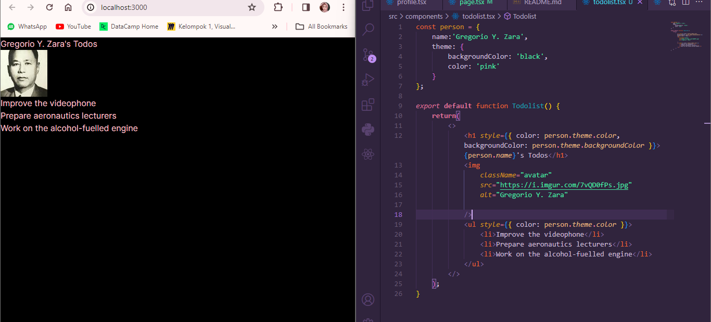

This is a [Next.js](https://nextjs.org/) project bootstrapped with [`create-next-app`](https://github.com/vercel/next.js/tree/canary/packages/create-next-app).

## Laporan Praktikum - Week 3 Pemprograman Framework

First, run the development server:

```bash
npm run dev
# or
yarn dev
# or
pnpm dev
# or
bun dev
```

Open [http://localhost:3000](http://localhost:3000) with your browser to see the result.

You can start editing the page by modifying `app/page.tsx`. The page auto-updates as you edit the file.

This project uses [`next/font`](https://nextjs.org/docs/basic-features/font-optimization) to automatically optimize and load Inter, a custom Google Font.


## Laporan Praktikum

|  | Pemrograman Berbasis Framework 2024 |
|--|--|
| NIM |  2141720216|
| Nama |  Anisa Rahmasari |
| Kelas | TI - 3A |

## Jawaban Soal 1
Bukti berhasil melakuakan edit pada kode Home dengan memanfaatkan komponen Profile()

<!--  -->

## Jawaban Soal 2
Syntax `import { Gallery } from "@/components/gallery";` merupakan pernyataan named imports. Selain itu, pada file gallery.tsx melakukan default import dari file profile.tsx, kemudian di file ini juga terdapat named function dengan nama Gallery yang berisikan pemanggilan dari function Profile


## Jawaban Soal 3
Berikut merupakan hasil dari perbaikan kode pada soal no.3


Kita dapat memperbaiki kodenya dengan cara mengganti tag div dengan `fragment`. Selain itu, terdapat error yaitu pada kode `<b> Juga ada <i>foto</b></i> ilmuwan!` seharusnya diperbaiki menjadi `<b>Juga ada <i>foto</i></b> ilmuwan!`


## Jawaban Soal 4

Kode diatas dapat diperbaiki dengan cara menambahkan `fragment` dan menambahkan `{person.theme}` ke dalam element `style` pada tag `h1`. Kemudian untuk memanggil nama pada element person bisa diperbaiki dengan cara `{person.name}`.